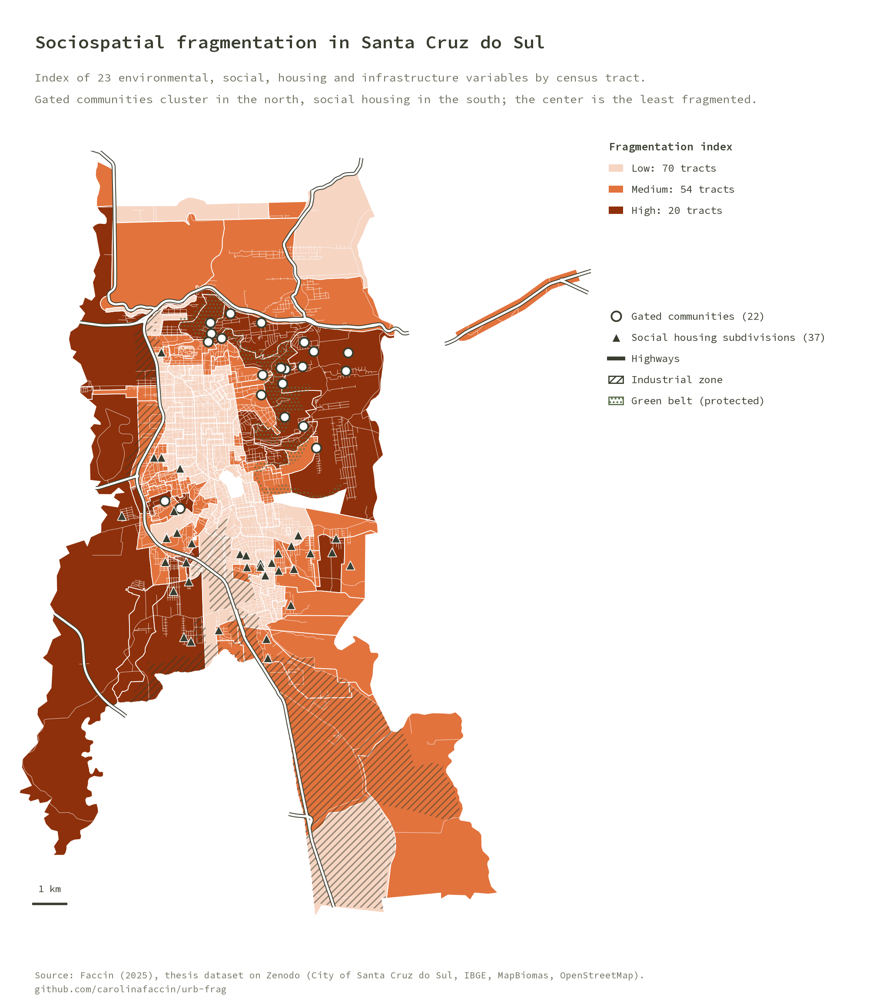
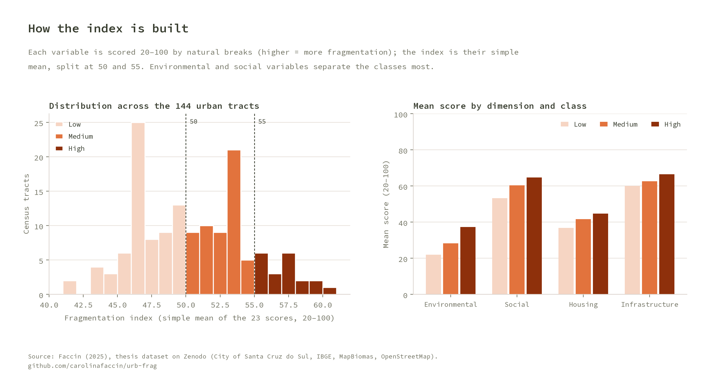
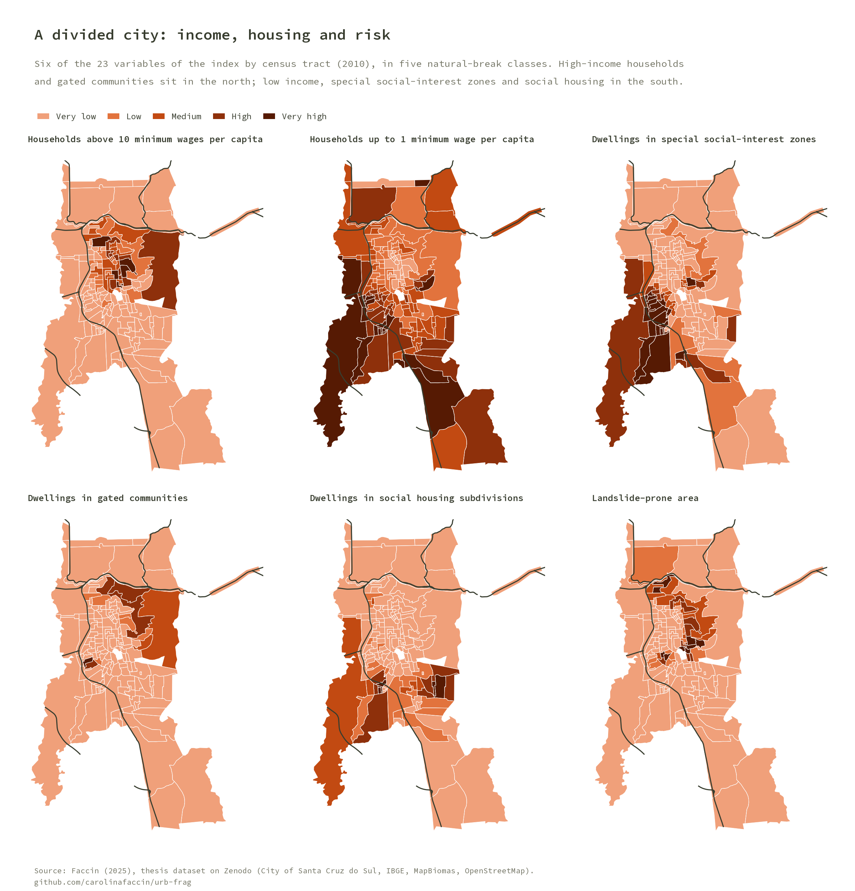
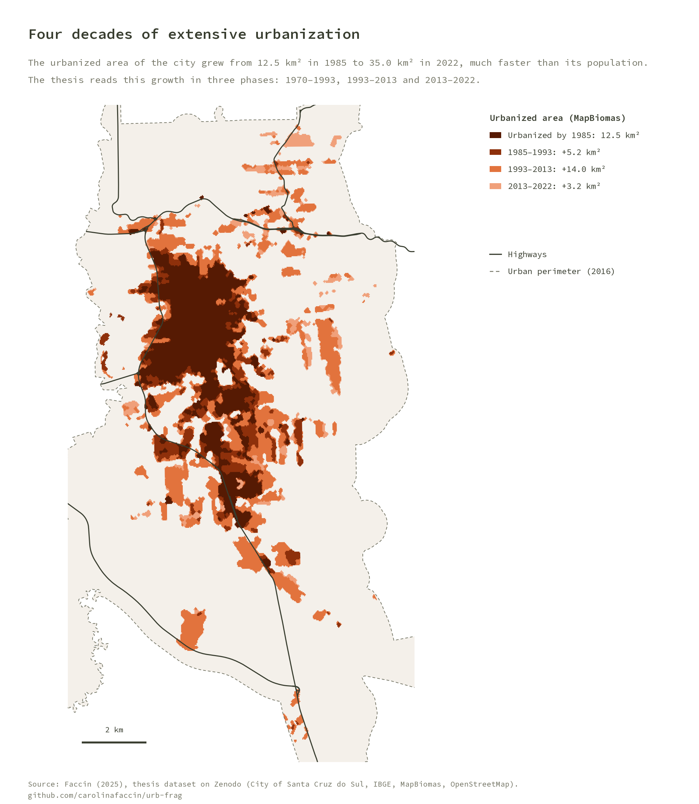
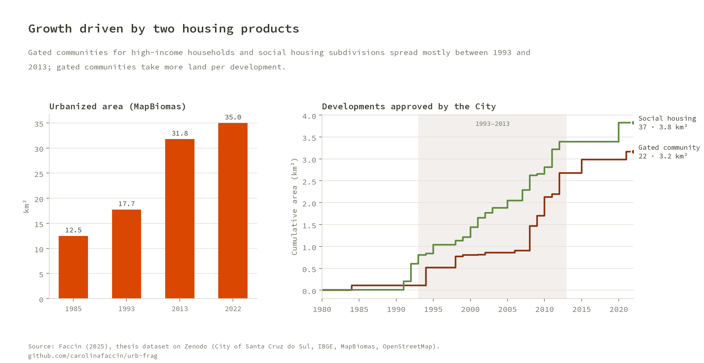
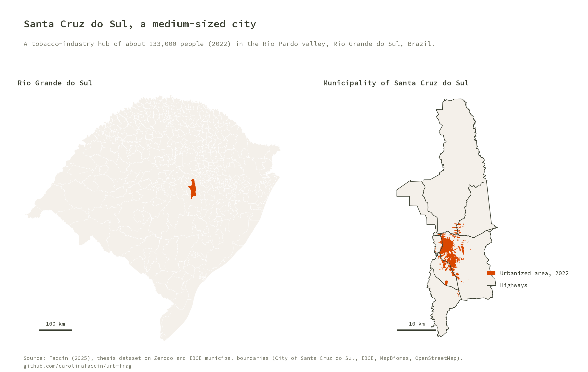
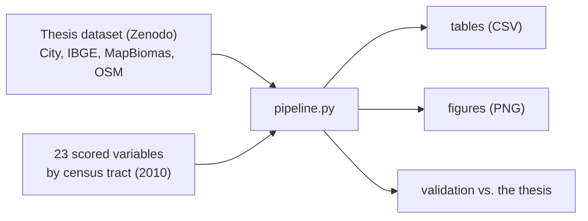

# URB-FRAG

**Sociospatial fragmentation in Santa Cruz do Sul, Brazil.** A reproducible analysis of the PhD thesis *Urbanização, fragmentação socioespacial e repercussões na paisagem da cidade média de Santa Cruz do Sul-RS* (Faccin, 2025, PROPUR/UFRGS): a fragmentation index built from 23 variables by census tract, urban growth since 1985 and the two housing products that drove it, gated communities and social housing subdivisions.

It rebuilds, in Python, the index and the figures of the thesis from its [open dataset on Zenodo](https://doi.org/10.5281/zenodo.16423545) and checks them against the numbers the thesis reports. The thesis text is on [LUME/UFRGS](https://lume.ufrgs.br/handle/10183/294929).

## Key results

- **A city split north–south.** Of the 144 urban census tracts, 70 have low fragmentation (the center), 54 medium and 20 high. High values concentrate in the north, around the gated communities and the Green Belt, and in the west and south, where social housing, special social-interest zones, informal settlements and landslide or flood risk meet.
- **Environmental and social variables separate the classes most.** The mean environmental score goes from 22 in low-fragmentation tracts to 37 in high ones; the social score from 53 to 65.
- **Extensive urbanization.** The urbanized area of the city grew from 12.5 km² in 1985 to 35.0 km² in 2022 (MapBiomas), much faster than its population.
- **Two housing products, one period.** 22 gated communities (3.2 km²) and 37 social housing subdivisions (3.8 km²) were approved; 82% of the gated communities and 83% of the social housing subdivisions date from 1993–2013. Gated-community land tripled between 2007 and 2013, from 0.9 to 2.7 km².

## Figures













## How it works



1. **Index variables.** 23 variables in four dimensions (environmental, social, housing, infrastructure; thesis, Quadro 4.5) by 2010 census tract. Each was classified by natural breaks (Jenks) into five classes and scored 20, 40, 60, 80 or 100, higher meaning more fragmentation; variables where more is better (health posts, schools, water, bus lines) were inverted.
2. **Index.** The simple mean of the 23 scores, as in the thesis' map algebra. Thresholds: low up to 50, medium up to 55, high above 55.
3. **Urban growth.** MapBiomas urbanized area of the municipal seat in 1985, 1993, 2013 and 2022.
4. **Housing developments.** Gated communities and social housing subdivisions approved by the City, with their year, grouped in the thesis' three phases (1970–1993, 1993–2013, 2013–2022).

## Run it

```bash
python -m venv venv && source venv/bin/activate
pip install -r requirements.txt
cp config/config.local.json.example config/config.local.json   # set the folders
python pipeline.py                               # tables + figures + README images
python pipeline.py --only figures docs           # redraw figures only
pytest                                           # unit tests + validation against the thesis
```

`config/config.local.json` (gitignored) sets three folders:

| Key | Purpose |
|---|---|
| `dataset_dir` | The thesis dataset. Missing GeoPackages are downloaded from Zenodo (about 100 MB) |
| `raw_dir` | Optional. Shared raw-data catalog with the scored index variables by tract (`prefeituras_municipais/santa_cruz_do_sul/producao_carolina/scs_carolina/algebra_de_mapas/`) and the state's municipalities (`ibge/malha_municipal/2022/`). Without it, the index figures are skipped |
| `data_dir` | This project's outputs: `tables/`, `figures/` |

## Outputs (`data_dir`)

| File | Content |
|---|---|
| `tables/fragmentation_index_by_tract.csv` | Index, class, the 23 scores and the four dimension means by tract |
| `tables/fragmentation_index_summary.csv` | Tracts and area by class |
| `tables/dimensions_by_class.csv` | Mean score of each dimension by class |
| `tables/urban_growth.csv` | Urbanized area by year, growth and annual rate |
| `tables/developments.csv`, `developments_by_phase.csv` | Gated communities and social housing subdivisions, and their count and area by phase |
| `tables/validation.csv` | Computed vs. published values |
| `figures/*.png` | All figures (copied to `docs/img/` for this README) |

## Validation

`pipeline.py` stops with an error if a value drifts from the published one (2% tolerance; the count must be exact).

| Check | Thesis | Computed |
|---|---|---|
| Index minimum | 41.7 | 41.7 |
| Urbanized area 1993 / 2013 / 2022 (km²) | 17.74 / 31.78 / 35.00 | 17.73 / 31.77 / 34.99 |
| Gated communities | 22 | 22 |
| Gated communities from 1970–1993 / 2013–2022 | 4.55% / 13.64% | 4.55% / 13.64% |
| Gated-community area by 2007 / 2013 (km²) | 0.90 / 2.70 | 0.90 / 2.68 |

The tract index matches the thesis raster (`resultado_media_simples_v3.tif`, sampled inside each tract) at every tract (largest difference below 0.00001).

## Notes on the data

- **Index maximum.** The thesis reports a range of 41.7 to 60.8; by tract the maximum is 60.0. The 60.8 probably comes from raster cells on tract edges, where the 10 m rasters of different variables do not align exactly.
- **Scores.** The thesis text describes scores of 0 to 100 in steps of 25; the scored layers use 20 to 100 in steps of 20. The pipeline uses the layers, which reproduce the published map.
- **Urbanized area in 1985.** The Zenodo layer gives 12.5 km²; the thesis table gives 8.67 km², probably from a different clip, so 1985 is not part of the validation.
- **Social housing subdivisions.** The Zenodo layer `scs_loteamentos-fechados_2022_pol` holds the social housing (popular and COHAB) subdivisions, despite its name: 37 polygons, while the thesis counts 33 subdivisions of houses.
- **Census 2010.** The index uses 2010 tracts because the 2022 tract data were not fully released when the thesis analysis was done.

## Repository layout

```
pipeline.py            orchestrator (tables, figures, docs)
src/urbfrag/
  config.py            paths from config/config.local.json
  data.py              dataset download and loading, the 23 variables
  metrics.py           index, urban growth, developments, validation
  figures.py           figures
  style.py             figure style: source line and repository name
  brand.py             visual identity (colors, palettes, Source Code Pro, layout); copied
                       from the author's brand repository, do not edit here
tests/                 synthetic unit tests + validation against the thesis
assets/fonts/          Source Code Pro (SIL OFL)
```

## Credits

Thesis: Faccin, C. R. (2025). *Urbanização, fragmentação socioespacial e repercussões na paisagem da cidade média de Santa Cruz do Sul-RS.* PhD thesis, PROPUR/UFRGS.

Data: [thesis dataset on Zenodo](https://doi.org/10.5281/zenodo.16423545) (City of Santa Cruz do Sul, [IBGE](https://www.ibge.gov.br/), [MapBiomas](https://mapbiomas.org/), [OpenStreetMap](https://www.openstreetmap.org/copyright) contributors, ODbL). Figures use the Source Code Pro typeface (SIL Open Font License).

## License

GNU General Public License v3.0, see [LICENSE](LICENSE).
